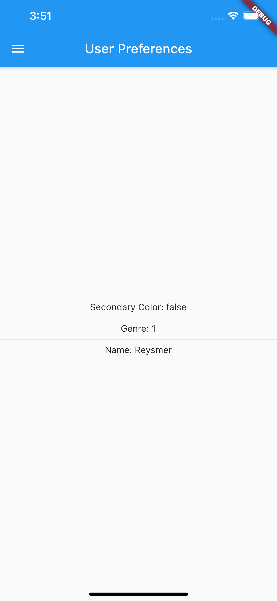
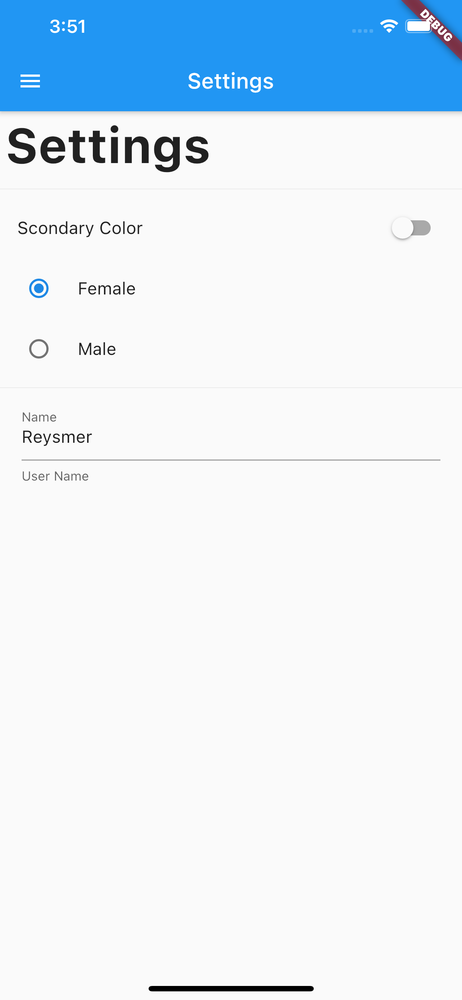

# Flutter User Preferences App

> Flutter User Preferences App is based on [Flutter: Tu guía completa de desarrollo para IOS y Android](https://www.udemy.com/course/flutter-ios-android-fernando-herrera/)

## ❗️ Requirements

- Dart >= 2.9.3
- Flutter >= 1.20.4

## 👁 Preview

## ⬇️ Version

1.0.0

## 🛠 Installation

Download zip file and extract it [latest release](https://github.com/reysmerwvr/user_preferences_app). Or clone the repository and cd into it.

flutter_desings_app uses a number of open source projects to work properly:

- [Dart] - Dart
- [Flutter] - Flutter

This project is a starting point for a Flutter application.

A few resources to get you started if this is your first Flutter project:

- [Lab: Write your first Flutter app](https://flutter.dev/docs/get-started/codelab)
- [Cookbook: Useful Flutter samples](https://flutter.dev/docs/cookbook)

For help getting started with Flutter, view our
[online documentation](https://flutter.dev/docs), which offers tutorials,
samples, guidance on mobile development, and a full API reference.

## 📦 Resources Links

- [Widgets de la semana - Youtube](https://www.youtube.com/watch?v=b_sQ9bMltGU&list=PLjxrf2q8roU23XGwz3Km7sQZFTdB996iG&index=1)

## Meta

Reysmer Valle – [@ReysmerWVR]

## License

Flutter User Preferences App is (c) 2020 Reysmer Valle ([@ReysmerWVR]) and may be freely distributed under the [license-url](LICENSE). See the `MIT-LICENSE` file.

### 📝 Todos

- [ ] Write tests
- [ ] Add code comments

[//]: # (These are reference links used in the body of this note and get stripped out when the markdown processor does
its job. There is no need to format nicely because it shouldn't be seen. Thanks SO - http://stackoverflow.com/questions/4823468/store-comments-in-markdown-syntax)

   [Dart]: <https://dart.dev/>
   [Flutter]: <https://flutter.dev/>
   [@ReysmerWVR]: <http://twitter.com/ReysmerWVR>
